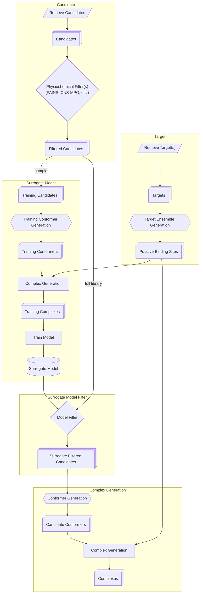

# Lynceus

Named after the mythological figure renowned for extraordinary vision, reflecting the platform's goal of identifying transient conformations, cryptic interfaces, and corresponding actionable protein states.

**Lynceus** is a modular computational platform for discovering molecules that recognize specific protein conformational states and couple that recognition to a desired biological outcome.

## Motivation

Most ligand discovery pipelines treat a target protein as a single rigid structure - typically whatever conformation happens to be available from a crystal structure or a single predicted model. This is a poor approximation of reality. Proteins are dynamic ensembles: they sample multiple conformational substates, some only transiently, and a substantial fraction of biologically important recognition events (allosteric regulation, cryptic pocket opening, order-disorder transitions, conformational selection in signaling) depend on states that are rare, short-lived, or simply absent from static structural databases.

Lynceus is built around the premise that **conformational state is itself the design target**, not an afterthought to be handled by post-hoc induced-fit correction. The platform generates a representative ensemble of target states up front, screens against that ensemble (rather than a single structure), and uses a trained surrogate model to make ensemble-aware screening tractable at library scale. The outputs are candidates (small molecules, proteins, etc.) with an associated *state preference*, the information needed to couple binding to a specific functional or biological outcome (e.g., stabilizing an inactive state, blocking an interface that only forms transiently, or selectively engaging a disease-associated conformation over the wild-type/resting one).

## Architecture

