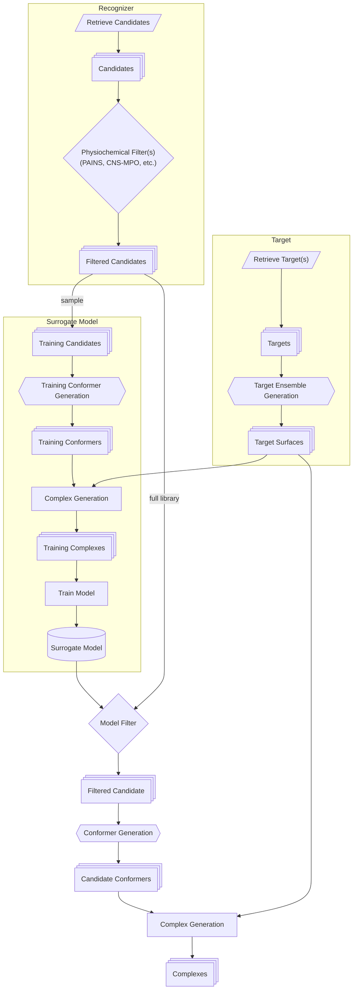

# Lynceus

Named after the mythological figure renowned for extraordinary vision, reflecting the platform's goal of identifying transient conformations, cryptic interfaces, and corresponding actionable protein states.

**Lynceus** is a modular computational platform for discovering molecules that recognize specific protein conformational states and couple that recognition to a desired biological outcome.

## High-Level Architecture

