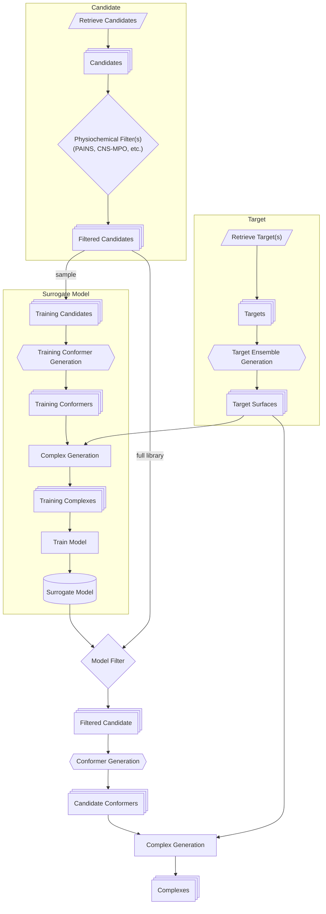

# Lynceus Architecture

## High-Level Architecture

## Stage Breakdown

### Stage 1 — Target

**Goal:** turn a protein of interest into a structural ensemble that captures its functionally relevant conformational diversity, rather than a single static pose.

- **Retrieve Target(s):** identify and pull the starting structural information for the protein(s) of interest. This may draw on experimentally determined structures, predicted structures, or a combination, and may include multiple distinct proteins if the project involves a family, a complex, or comparative targets (e.g., disease variant vs. wild-type).
- **Target Ensemble Generation:** expand each starting structure into a set of conformers representing the protein's accessible states. The intent is to surface states that a single static structure would miss — alternate side-chain rotamers, loop conformations, domain motions, cryptic or transiently open pockets, and active/inactive backbone states. The output is a *population* of structures rather than one.
- **Target Surfaces:** from the ensemble, derive the relevant surface/pocket representations that candidates will actually be screened against (e.g., binding site definitions, surface descriptors, or other representations of the regions of interest on each conformer). This is the structural information that downstream complex generation steps consume — it defines *where* and *against what shape* recognition is being evaluated for each state in the ensemble.

**Output:** a labeled set of target surfaces, one or more per conformational state, that collectively represent the protein's relevant conformational landscape.

### Stage 2 — Candidate

**Goal:** assemble the candidate molecule space and reduce it to a tractable, drug-like (or otherwise fit-for-purpose) set before any structural modeling is performed.

- **Retrieve Candidates:** pull in the pool of candidate molecules to be screened. This may be a purchasable/synthesizable virtual library, a proprietary collection, a focused set around a known chemotype, or some combination.
- **Physiochemical Filter(s):** apply cheap, structure-independent filters to remove candidates unlikely to be useful regardless of how well they might dock — e.g., pan-assay interference compounds (PAINS), property-based filters such as CNS multiparameter optimization (CNS-MPO) scoring when relevant, and other standard developability/liability screens. The point of doing this *before* any conformer or complex generation is cost: these filters are computationally cheap relative to 3D structure generation and complex modeling, so it's far more efficient to eliminate unsuitable candidates first.

**Output:** a filtered candidate library — large, but stripped of molecules that fail basic chemical viability or known liability criteria.

### Stage 3 — Surrogate Model

**Goal:** train a fast approximate model that can predict target-state recognition without requiring full conformer and complex generation for every candidate in the library.

This stage exists because generating high-quality conformers and target–candidate complexes for the *entire* filtered library against the *entire* target ensemble is computationally prohibitive at scale. Instead, a representative subsample is processed in full fidelity, and that data is used to train a model that approximates the same judgment much more cheaply.

- **Sample Training Candidates:** draw a representative subsample from the filtered candidate library — sized and selected so that it spans the chemical diversity of the full library well enough to train a generalizable model.
- **Training Conformer Generation:** generate 3D conformers for the training subsample only.
- **Complex Generation (training):** model the training conformers against the target surfaces produced in Stage 1, producing a set of training complexes spanning the relevant conformational states.
- **Train Model:** use the training complexes to train the surrogate model. The model learns to approximate whatever signal the full complex-generation process would produce (e.g., expected recognition or fit against particular target states) directly from candidate (and target-state) features, without re-running full complex generation.

**Output:** a trained surrogate model capable of scoring or filtering the full candidate library against the target ensemble at a fraction of the cost of exhaustive complex generation.

### Stage 4 — Ensemble Screening

**Goal:** apply the trained surrogate model to the full filtered library to identify the subset of candidates worth carrying through to full-fidelity modeling, then generate detailed structural complexes for that subset.

- **Model Filter:** score the *entire* filtered candidate library (not just the training subsample) using the trained surrogate model, and retain the subset predicted to be most promising. This is the step that makes ensemble-scale screening practical — the expensive full-fidelity steps that follow are only run on this much smaller, pre-triaged set.
- **Conformer Generation:** generate full 3D conformers for the surrogate-filtered candidates — the same step performed in Stage 3, now applied to the larger downstream-filtered set rather than just the training subsample.
- **Complex Generation:** model the resulting candidate conformers against the target surfaces from Stage 1, producing final target–candidate complexes spanning the relevant conformational states.

**Output:** a set of high-fidelity target–candidate complexes, each implicitly or explicitly annotated with the target conformational state it corresponds to — the basis for downstream selection of candidates with a desired state preference and biological outcome.

## Design Notes

- **Why an ensemble, not a single structure?** Single-structure screening implicitly assumes the bound or relevant conformation is well-represented by whatever structure is available. For cryptic pockets, allosteric sites, and transient interfaces, this assumption frequently fails. Generating the ensemble up front means screening can target *specific* conformational states rather than only the most common/stable one.
- **Why a surrogate model rather than full screening throughout?** Conformer generation and complex generation are both substantially more expensive than physiochemical filtering or model inference. Running them against an entire library, for every conformational state in the target ensemble, does not scale. The surrogate model is trained on a representative subsample precisely so that the expensive steps are only repeated, at full library scale, once a much smaller and better-justified set of candidates has been identified.
- **Two distinct "Complex Generation" steps:** the diagram intentionally shows complex generation occurring twice — once in the Surrogate Model stage (training data) and once in the Ensemble Screening stage (final candidates). These share the same target surfaces but operate on different candidate populations and serve different purposes: one produces training data, the other produces the final deliverable.
- **State-aware output:** because target surfaces are tagged by conformational state throughout the pipeline, the final complexes retain that state information. This is what allows downstream selection of molecules by *which* state they recognize, not just whether they bind at all — the property the platform is named for.
